# Renaissance Web — Design Audit

**Audit date:** 11 August 2026
**Audited surface:** local production build at 1440 × 1000 and 390 × 844
**Scope:** homepage composition, primary navigation, mobile menu, story carousel, service presentation, founder/origin section, global reach, contact path, footer, design tokens, responsive behavior, accessibility, performance architecture and Pagebuilder governance.

## Executive outcome

Renaissance already has a distinctive, credible visual idea. The editorial game-world direction, the compressed IBM Plex typography, the petrol/sand palette and the scale of the game imagery make the brand recognizable without relying on navigation alone. Desktop and mobile both avoid horizontal overflow, the hero communicates the offer quickly, and the supplied imagery is treated as content rather than decoration.

The current limitation is not visual originality; it is system maturity. Important behaviors are still implicit in individual components. Deep links to deferred sections fail on a fresh page load, the mobile menu does not behave as a modal for keyboard or assistive-technology users, the carousel rotates without a user-controlled pause, and several legacy FLZR-era names remain in the authoring and token APIs. These gaps make the design attractive but not yet reliably reusable.

**Overall design-system health: 13 / 20 — solid branded foundation, not release-ready without the P1 fixes.**

| Dimension | Score | Summary |
| --- | ---: | --- |
| Accessibility | 2 / 4 | Strong labels, alt text, focus styling and reduced-motion coverage; menu modality, carousel control, heading order and low-contrast secondary text need work. |
| Performance | 2 / 4 | Hero preload and deferred loading are good; raw large images, WebGL-enhanced buttons, the 3D globe and overly coarse section deferral add cost and behavior risk. |
| Theming | 3 / 4 | A coherent Renaissance palette and typography are present; raw values and legacy violet/lime aliases still weaken the semantic layer. |
| Responsive design | 3 / 4 | No horizontal overflow at either audited viewport and the hero/menu adapt well; services and the globe create excessive mobile depth. |
| System integrity | 3 / 4 | Strong repeated visual language; the broad registry lacks an explicit Renaissance support matrix and authoring guardrails. |

## What is already strong

- **The brand passes the first-viewport test.** The wordmark, game world and verbal point of view dominate the hero; the page would not plausibly belong to another agency after removing the navigation.
- **The visual language is coherent.** Petrol, ink, sand and mist repeat with purpose. Diagonal streaks, hairlines and selective large radii create recognition without turning into decorative clutter.
- **The hero has a clear hierarchy.** Brand, one message, one support statement, one primary action, one secondary action and one dominant visual plane are all visible without secondary marketing noise.
- **The story stage feels editorial rather than card-based.** It gives campaign imagery enough scale, keeps controls visible and pauses rotation on hover/focus.
- **Responsive fundamentals are sound.** Runtime checks found `0px` horizontal overflow at 1440px and 390px. The mobile headline remains legible and the menu has appropriately large visible link targets.
- **Motion has a defined character.** The hero reveal, section entrances, carousel transition and button response share a restrained directional language, with reduced-motion branches already present in several components.
- **Content remains honest.** The page does not invent unsupported campaign metrics. This should stay a system rule.

## Audited journey

### 1. Orientation and value proposition

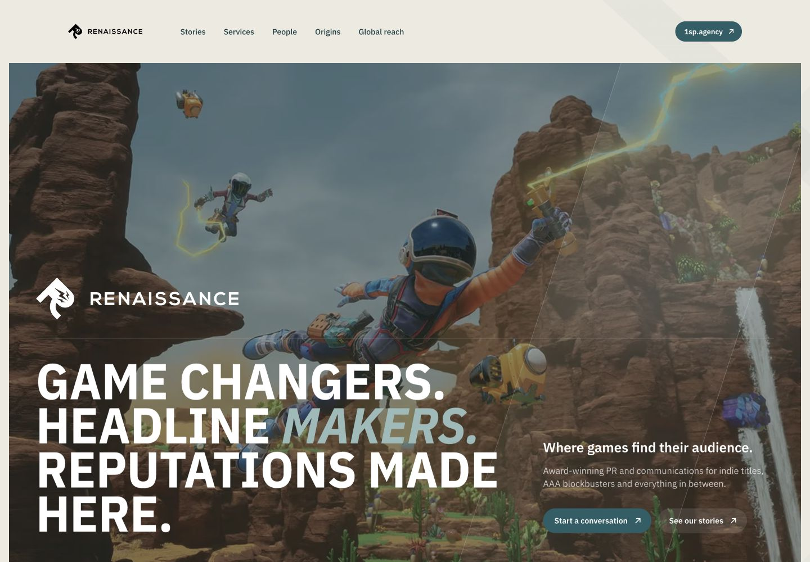

**User goal:** understand who Renaissance is, what it does and what to do next.

The hero succeeds visually. The game image is genuinely dominant, the wordmark is unmistakable, and the headline has enough editorial force to own the first viewport. The support copy is short and the CTA pair is easy to distinguish.

The conversion path is inconsistent: the hero uses a `mailto:` link, while the footer sends users to the working `/contact` route. `Button2` also treats `mailto:` and `tel:` as external websites and opens them with `target="_blank"`. The system should define one primary contact journey and a secondary direct-email escape hatch.

### 2. Proof through stories

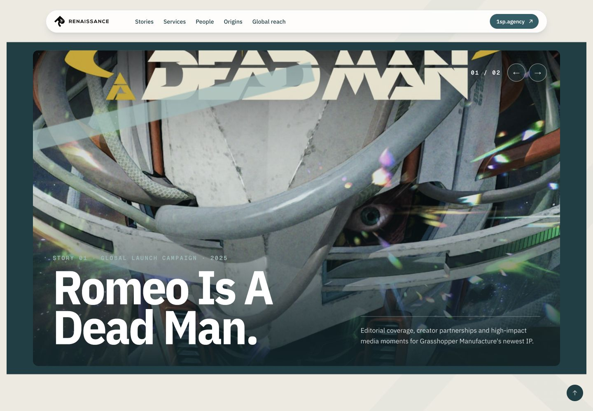

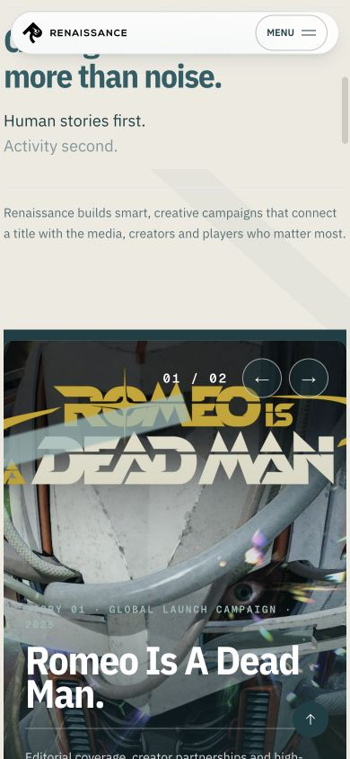

**User goal:** see relevant games work and build confidence in Renaissance's experience.

The full-width story stage is one of the strongest components. Image scale, crop, typography and controls communicate campaign work without turning cases into small cards. Pointer and keyboard focus pause automatic rotation and reduced-motion disables it.

The carousel still rotates every seven seconds without a visible pause control, and the active story change is not announced (`aria-live` is absent). The current `01 / 02` status is only visual. Mobile touch users have no persistent stop mechanism. The image is rendered with raw `<motion.img>` rather than the optimized image pipeline.

### 3. Offer and service model

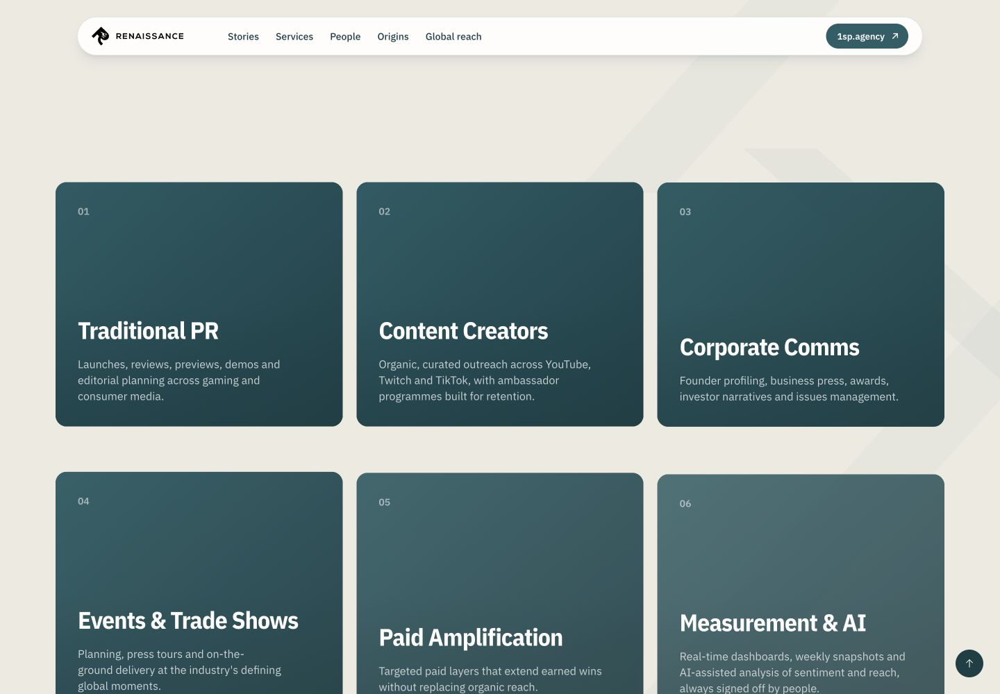

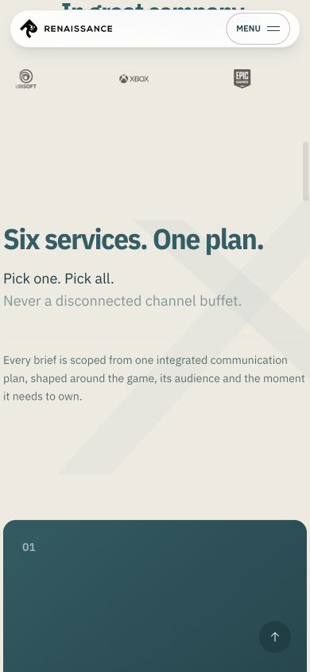

**User goal:** understand the service range and whether it forms one coherent offer.

The introductory copy gives the six services a strategic frame instead of presenting a disconnected list. Desktop scanning is good and the visual repetition is controlled.

On mobile, six non-interactive cards at a minimum height of 22rem create roughly 2,400px of near-identical scrolling. Because the cards do not contain an interaction, the heavy card treatment is not necessary for comprehension. The mobile system should switch this component to an editorial ruled list or a significantly denser tile rhythm.

### 4. Human proof and origin

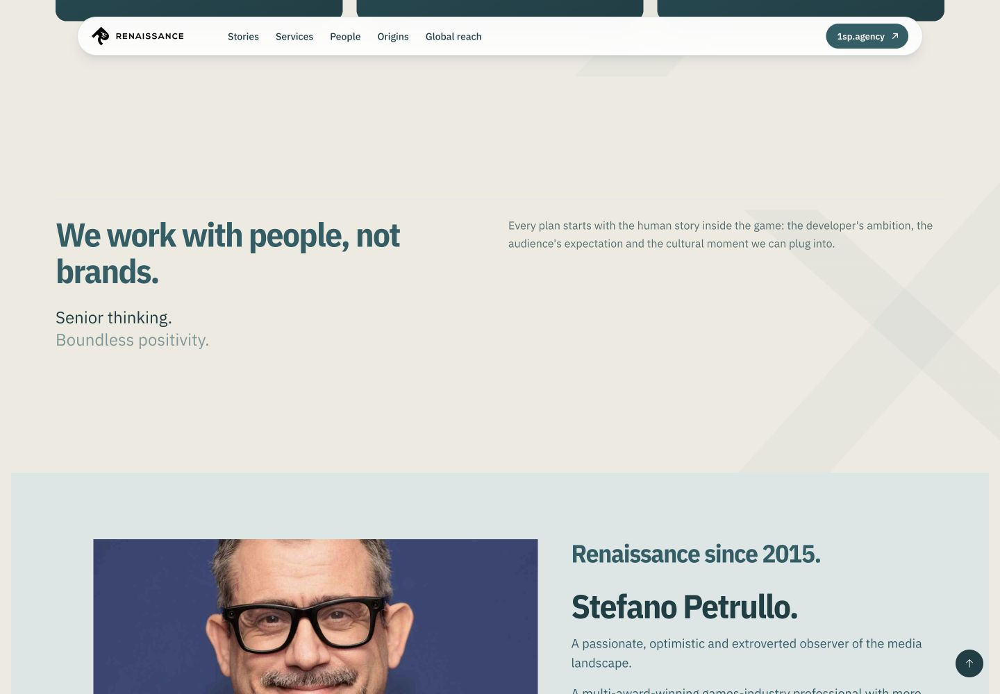

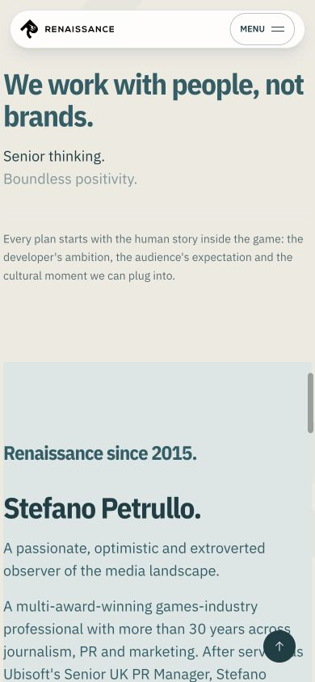

**User goal:** understand the senior perspective and the person behind the agency.

The copy sequence is strong: philosophy first, founder second. The founder image is meaningful, has a descriptive alt value and gives the page a real human anchor. The mist surface creates a useful tonal pause.

The heading hierarchy is inconsistent. Intro sections render their main visible headings as `h3`, while “In great company” is an `h2`; the origin section then contains two adjacent `h2` elements. The design system needs semantic roles that are independent from visual size.

### 5. Global reach, contact and family context

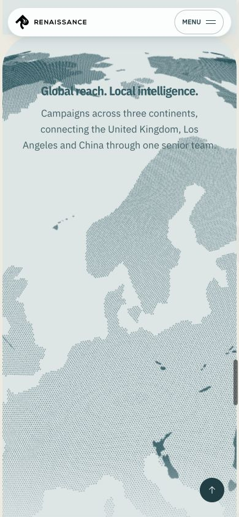

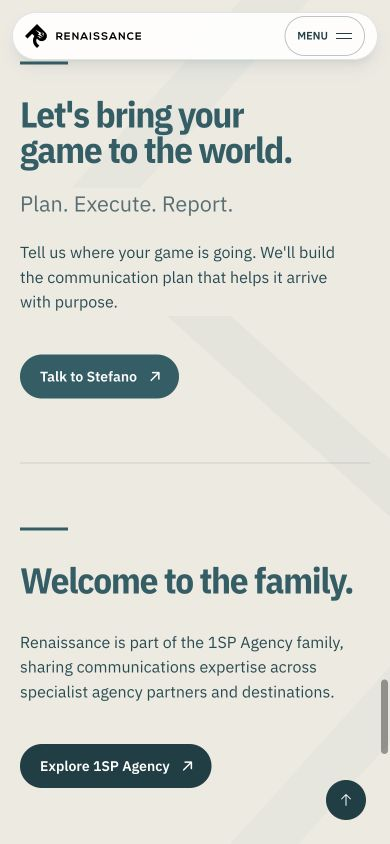

**User goal:** verify international reach and start a conversation.

The contact copy is direct and the 1SP relationship is communicated without overpowering Renaissance. The CTA treatment is clear and consistent with the hero.

The mobile global-reach passage is visually too deep: a large map field occupies most of a viewport before the location information can be scanned. The map is useful atmosphere, but it should not delay the concrete location list. A static or simplified mobile map with an adjacent text list would be more robust and less expensive.

### 6. Mobile navigation and footer

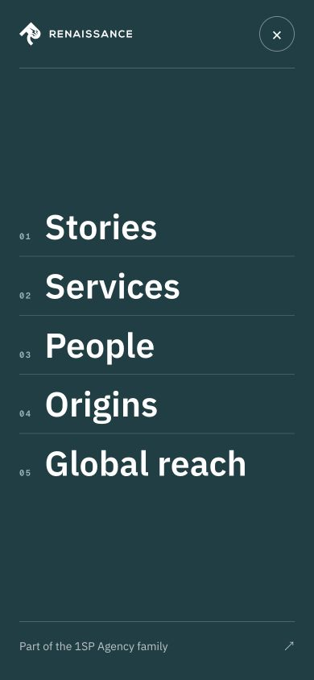

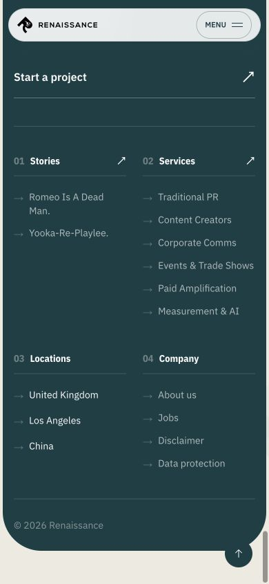

**User goal:** move between page sections and find deeper company information.

The menu is visually excellent: large targets, a clean numbered rhythm and enough contrast. The footer has good information architecture and the 2 × 2 mobile column layout remains readable.

Runtime inspection found no dialog role, no `aria-modal`, no inert background and no `aria-hidden` on the underlying main/footer. Focus remains on the hidden “Open menu” control after opening; Escape does not close the menu; closing places focus on `body` rather than returning it to the trigger. The overlay therefore looks modal without being modal.

## Prioritized findings

### P1 — must fix before launch

#### P1.1 Deferred sections break fresh deep links

- **Evidence:** on a fresh page load only `#stories` exists in the DOM. `#services`, `#people`, `#origins` and `#global-reach` do not exist because all blocks after index 2 live inside `DeferredSection`. Clicking “Services” produced `location.hash === '#services'` while `scrollY` remained `0`.
- **Impact:** primary navigation appears functional but four of five page-section links do nothing until the user has already scrolled far enough to mount the deferred block.
- **Standard:** every visible navigation destination must exist and be focusable when the navigation is first available.
- **Recommendation:** never defer a navigable section boundary. Render lightweight anchor sentinels for every `navPointName`, or defer the heavy internals inside a server-rendered section shell. Add a fresh-load test for every generated anchor.

#### P1.2 Mobile menu is not a keyboard-safe modal

- **Evidence:** `dialogs: 0`, `aria-modal: 0`, no inert nodes, `main[aria-hidden]` absent; focus stays on “Open menu”; Escape leaves the menu open; close returns focus to `body`.
- **Impact:** screen-reader and keyboard users can reach content behind the overlay and lose their place.
- **Standard:** WCAG 2.1.1 Keyboard, 2.4.3 Focus Order and the WAI-ARIA modal dialog pattern.
- **Recommendation:** implement the menu with the shared accessible dialog primitive or add `role="dialog"`, `aria-modal="true"`, focus placement, focus containment, Escape handling, background inertness and trigger focus restoration.

#### P1.3 Carousel lacks a persistent pause mechanism

- **Evidence:** stories rotate every 7 seconds; rotation pauses on hover/focus and respects reduced motion, but there is no visible pause button and no `aria-live`/manual-change announcement.
- **Impact:** touch and cognitive-accessibility users cannot reliably stop the changing content without interacting with another control.
- **Standard:** WCAG 2.2.2 Pause, Stop, Hide and WAI carousel guidance.
- **Recommendation:** add a pause/play control, default to paused on touch-sized viewports, expose active-slide state, and announce user-triggered changes with a polite live region while keeping autoplay announcements off.

#### P1.4 Contact intent is split across two primary routes

- **Evidence:** hero “Start a conversation” and section “Talk to Stefano” use `mailto:`, while footer “Start a project” uses the working `/contact` page. `Button2` opens mail and phone schemes in a new browsing context.
- **Impact:** measurement, confirmation, validation and user expectations vary depending on where contact begins.
- **Recommendation:** make `/contact` the canonical primary action everywhere; keep a visible direct-email option on that page. Never add `target="_blank"` to `mailto:` or `tel:`.

### P2 — important system hardening

#### P2.1 Muted text tokens are not safely readable on paper

- `#536f73` on `#edeae1` is **4.49:1**, just below the 4.5:1 AA threshold for normal text.
- `#7d9899` on `#edeae1` is **2.56:1** and must be limited to large decorative text, disabled states or non-essential graphics.
- **Recommendation:** introduce `text.subtle` at a verified minimum of 4.5:1 and reserve the current lighter token for large accent copy only.

#### P2.2 Desktop navigation links have undersized hit areas

- **Evidence:** text links measure approximately 19px high, although the CTA is 36px high.
- **Recommendation:** give every desktop nav link at least a 24 × 24px clickable box, preferably 32px high, without visually enlarging the typography.

#### P2.3 Semantic heading levels are coupled to component visuals

- **Evidence:** the document jumps from the `h1` to an `h3`; intro and CTA components emit `h3` regardless of page position.
- **Recommendation:** every section block accepts or derives a semantic `headingLevel` while visual typography uses a separate style role. Homepage primary sections should normally be `h2`; component titles below them should be `h3`.

#### P2.4 Legacy color and variant APIs leak into Renaissance authoring

- **Evidence:** the fallback homepage authors `variant: "violet"`; CSS remaps violet, purple, blue and lime utilities to the Renaissance palette; several raw hex values repeat across components.
- **Impact:** the rendered output looks correct, but editors and developers cannot tell which names are canonical and which are compatibility debt.
- **Recommendation:** add `brand`, `dark`, `glass` and `ghost` as the only public Renaissance action variants. Keep legacy aliases internal and log/deprecate their use.

#### P2.5 Heavy media bypasses the optimized image contract

- **Evidence:** the story carousel and two-column content use raw `<motion.img>`; the globe uses WebGL/canvas; buttons may activate a shader or strands field after hover.
- **Recommendation:** use optimized image components with explicit `sizes`, preserve only one immersive WebGL moment per page, and provide static mobile/data-saver fallbacks. Keep shader motion progressive, never required for action recognition.

#### P2.6 Mobile service and globe sections are too vertically expensive

- **Evidence:** service cards use `min-h-[22rem]`; all six stack on mobile. The map consumes most of a mobile viewport before concrete locations become scannable.
- **Recommendation:** use the compact mobile service-list variant and cap the mobile map to 55–65svh followed immediately by a text location list.

#### P2.7 Pagebuilder support is broader than the Renaissance system

- **Evidence:** `RenaissancePageBuilder` registers 35 block types, including reused 1SP groups and FLZR-era gallery/job components. Only a smaller subset has been visually validated for the Renaissance homepage.
- **Recommendation:** enforce the support tiers in [design-system/COMPONENTS.md](./design-system/COMPONENTS.md) in Studio previews and validation. A registered block is not automatically an approved Renaissance pattern.

### P3 — optimization and editorial maturity

- Add verified campaign outcome slots to stories when approved evidence exists; never fabricate metrics to fill the layout.
- Define an active navigation state and ensure idle-hide cannot make a focused navigation control inert. This focus-loss risk is inferred from the timer implementation and should be covered by an automated keyboard test.
- Reduce footer metadata contrast only where text remains above AA; keep legal and company links readable at 200% zoom.
- Add visual-regression snapshots for the hero, story stage, menu, compact service list, globe fallback and footer.

## Recommended implementation order

1. Fix deferred anchor shells and add fresh-load deep-link tests.
2. Replace the mobile menu behavior with an accessible modal pattern.
3. Establish one contact route and correct scheme-link behavior.
4. Add carousel pause/state semantics.
5. Apply the semantic token and heading-role migration.
6. Introduce mobile-density variants for services and global reach.
7. Enforce the Pagebuilder support matrix in Studio and CI.

## Evidence limits

- The audit used the local production build and current fallback homepage content. The active Sanity dataset contains no published Renaissance homepage, so CMS-authored composition drift could not be tested directly.
- Desktop and mobile were validated at the two listed viewports. Short landscape, tablet, zoom/reflow and assistive-technology sessions should be added to release QA.
- Runtime interaction checks covered primary navigation anchors, the story carousel, CTA targets and the mobile menu. No external analytics, real user data or production Core Web Vitals were available.
- Browser logs contained no application error. Cookiebot emitted the expected localhost authorization warning, so the production consent banner itself was not visually audited.

## System handoff

- Foundations and design rules: [DESIGN.md](./DESIGN.md)
- Approved components and Pagebuilder tiers: [design-system/COMPONENTS.md](./design-system/COMPONENTS.md)
- Working method and ownership: [design-system/README.md](./design-system/README.md)
- Definition of done: [design-system/RELEASE-CHECKLIST.md](./design-system/RELEASE-CHECKLIST.md)
