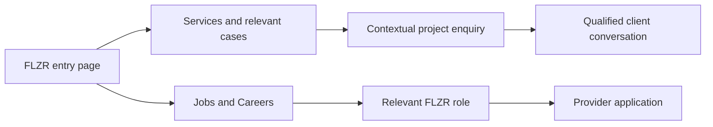

# FLZR conversion and information architecture plan

Status: **proposal, not implemented**. Audited 2026-09-20. Goal confirmed by the user: **qualified client enquiries and recruitment applications, with separate journeys**.

Follow-up context, 21 September: the shared green `minimenu` membership button has since been implemented in the local worktree. The navigation proposals below remain unapproved conversion hypotheses, not instructions to replace that later requested component. For service data ownership, use the [current handoff](SERVICE_CONTENT_HANDOFF.md); this plan concerns journeys and presentation.

## Recommendation

Preserve FLZR's identity and approved content. First make the next action obvious and easy: a persistent client enquiry route, a contact page that starts with the form, and a recruitment page that helps candidates find the right FLZR opportunity. Then improve how services, cases and the homepage support those decisions.

The strongest observed friction is on Contact: at a 390 × 844 mobile viewport, the form begins approximately **4,725 CSS pixels down the page**. Desktop inspection placed it approximately 3,039 pixels down at 1440 × 1000. These are local rendering observations, not analytics or abandonment measurements.

Do not introduce an audience-selection splash screen. Both journeys should be accessible immediately, and individual pages should prioritize their own audience.

## Evidence and limits

- Environment verified with `pnpm doctor:sanity --channel flizrWeb --language en`: project `wu6i3y0h`, dataset `production`, API version `2025-09-16`. Studio and FLZR agree on the data source. Published content was queried directly; local browser rendering used port 3001 with a temporary local site-URL override.
- Inspected the published homepage, navigation, Services, Contact, Careers, case listing, SONY case detail and video-consulting service journey. Desktop and mobile checks were targeted, not a complete responsive/accessibility certification.
- The published EN inventory has 20 pages, eight assigned services and 33 cases. The active homepage is `page-flizr-home-v3-preview-en` despite its name: 19 stored blocks including structural markers, not 19 visible sections.
- DE and PL each have one published page in the scoped inventory. This signals a need to verify complete localized journeys; it does not establish that every other route is broken or unavailable.
- No traffic, sales qualification, applicant completion or recruiting-quality dashboard was available in this audit. No form/application was submitted. External CRM notifications, Sanity webhooks and ATS reporting remain unverified.
- Refero reference search was unavailable because its subscription was inactive. Visual recommendations use the actual FLZR screens and existing design language. External sources below provide supporting patterns, not evidence of FLZR conversion uplift.
- Detailed source pointers and implementation caveats: [source audit](FLZR_CONVERSION_SOURCE_AUDIT.md). Copy authority and rollback history: [English implementation record](records/flzr/flzr-english-implementation.md).

## What is happening now

| Observed condition | Likely decision friction | Recommended response |
| --- | --- | --- |
| Header's prominent separate button leads to 1SP; Contact is absent from the main menu | Visitors have no equally prominent FLZR enquiry action | Put “Start a project” in that primary slot; retain group membership as secondary credibility |
| Contact renders four CMS blocks, including six marketing cards, before the form | Ready-to-enquire visitors must pass through another sales page | Start Contact with a short introduction and the existing form |
| Careers links to group Personio and myFLZR without explaining their relationship | Candidates must work out which destination is relevant | Explain provider routes accurately; distinguish finding work from existing-account login |
| Mobile Careers uses a long video-hero headline; “Apply now” starts around y=776 | Role discovery gets little space in the opening viewport | Use a more compact recruitment opening; place a clear jobs action early |
| Services have seven dedicated English detail pages; AI Solutions retains a modal | The next step differs across service journeys | Provide a consistent contextual enquiry action on both page and modal paths |
| Case selection opens a preview before the full story | An additional step separates browsing from evidence | Make the main action a direct case link; keep preview optional |
| SONY detail shows useful scope figures but relies on the generic footer enquiry action | Evidence is not closely connected to starting a similar project | Add a contextual enquiry after results; distinguish delivery scale from business outcomes |
| Homepage covers services, proof, reach, a large team selection and careers | Different visitor needs lengthen one another's journey | Tighten the sequence and move depth into the appropriate destination pages |

These are observed conditions and design hypotheses. Their effect on conversion has not been measured. The tested case overlay **does navigate successfully**; it is not a broken-link finding.

## Navigation and two journeys

Proposed top-level navigation:

**FLZR logo → Home · Services · Projects · Agency · Jobs & Careers · Start a project**

Keep “Projects” if it is already understood; test “Case studies” before renaming it. The logo can replace a separate Home menu item. Preserve established routes and aliases rather than coupling a label change to URL migration.

- Client pages: “Start a project” is the primary action; Jobs remains clearly accessible.
- Careers: prioritize “View open roles”; keep client contact available without dominating the recruitment content.
- Mobile: prototype a compact header with clear access to both destinations. Avoid a crowded row of equal buttons or a sticky bar that covers content. Test whether a visible Jobs link plus project action fits alongside the brand/menu; use clear menu placement if it does not.
- Retain 1SP membership in Agency/footer and relevant trust content. It should support a FLZR decision without occupying the strongest conversion slot.

## Page layouts

### Contact: complete the task immediately

Opening composition: short FLZR contact heading, one useful instruction, the form, and a named team or appropriate alternative contact method. On desktop these can share a simple two-column composition; on mobile put the form before secondary reassurance.

Keep the existing four visible fields: name, email, optional company and message. Do not add mandatory telephone, budget or upload fields by default. Indicate required/optional status clearly. Keep the existing spam protection.

Move broad marketing cards to a relevant marketing page or remove them from this route after editorial review. Place a small amount of relevant proof below the task. Preserve entered values on failure and provide accessible, localized error/success feedback.

Carry an optional service/case identifier from contextual CTAs so visitors do not need to repeat what they were looking at. Validate that context server-side; do not put personal data into URLs or analytics. Confirm the receiving team, notification path and response expectation before promising a response time.

### Careers: help people find suitable work

Recommended sequence:

1. Compact FLZR recruitment introduction and “View open roles” action.
2. Relevant roles, or clearly explained routes to the appropriate provider. If a reliable list is available, useful filters are location and work type, based on actual recruiting needs.
3. What the work and working conditions are like, supported by real team/field imagery.
4. A short, accurate application process and what happens next.
5. Existing-candidate login and recruiter help as distinct secondary actions.

The current first-job framing may underserve experienced applicants. Review that with recruiting before rewriting approved copy. Use real role context rather than automatically reusing the homepage video.

The current [Personio destination](https://1sp-agency.jobs.personio.de/) contains FLZR and other group-company roles. [myFLZR](https://www.my-flzr.com/) offers jobs, registration and login. Their role types overlap: do not assume one is for office jobs and the other for field work. Recruiting must confirm the routing rules and authoritative source for each role.

Start with clearer outbound destinations if that solves the problem. An integrated FLZR listing is a later option, not a prerequisite. If using the existing Personio block, fix explicit FLZR scoping and complete retrieval before filtering; its current result cap and inferred unit matching are not sufficient guarantees. Provide a provider fallback when feeds fail. Do not maintain duplicate manual job records just to create a unified appearance.

### Homepage: orient, prove, then route

Suggested composition for a wireframe, subject to review:

| Order | One job for the section | Existing material to reuse |
| --- | --- | --- |
| 1 | Establish FLZR and the client promise, with a clear enquiry action | Current hero treatment and approved positioning; Jobs remains in navigation |
| 2 | Demonstrate relevant work early | One strong case with an evidenced result or delivery fact and real project imagery |
| 3 | Help buyers identify the right service | All eight existing services, with concise approved descriptions and clear detail links |
| 4 | Build confidence in delivery | Compact reach/operating-model content and relevant people; Agency holds the deeper story |
| 5 | Invite a project conversation | Existing FLZR contact treatment |
| 6 | Give candidates a distinct route | Short Careers section linking to the recruitment journey |

Test moving selected proof before the service grid; do not assume it always wins. Keep service discovery close to the top. Consider buyer-question groupings only after checking actual enquiry themes; retain the eight service entities and names. Avoid adding a decorative layer of pills, cards or statistics.

The homepage currently includes a large team selection. Use a smaller purposeful representation here and let Agency carry the full team. This preserves people and personality without making prospective clients or candidates traverse every profile.

The previous homepage rewrite was deliberately rolled back. This proposal is not authorization to restore it. Reordering approved material and changing copy are separate editorial decisions.

### Services and cases: connect capability to evidence to action

Service detail sequence: clear service name and buyer benefit → what is included → relevant case evidence → delivery/process information where substantiated → contextual enquiry. Preserve the existing Services standalone hero, section badges and two-thirds contact composition.

Use relevant media for the service or work being discussed. On video consulting, retain the Saturn demonstration as optional evidence while adding a clear route for a prospective client to talk to FLZR.

Keep the case index's existing sector/service filters and pagination. Make full-case navigation the primary semantic link, with an optional separately labelled preview. Verify filter/back-navigation behavior and keyboard operation during implementation.

Case detail should answer: the client challenge, FLZR's contribution, evidence of results, and the next step for a similar need. Add “Discuss a similar project” near the end of that story, regardless of whether a named contact is assigned.

SONY's promoter, store and manager counts establish delivery scale. They are not sales-lift or ROI claims. Use available figures with clear labels, provenance and timeframes; do not invent outcomes or turn every paragraph into a counter. Make fuller editorial changes only where approved evidence exists.

## Visual direction

Keep the expressive italic typography, FLZR purple, rounded media treatment and established section language. The opportunity is clearer hierarchy and better pacing within that identity.

- Make FLZR a strong opening signal, with one headline, one short explanation and one primary action.
- Reduce long all-capital headline blocks on task-oriented pages. Rehierarchize approved text before requesting replacement copy.
- Preserve strong imagery on brand/service pages; let Contact and job discovery reach their task quickly.
- Use real projects and people as evidence. Avoid expanding the generic marketing-card treatment.
- Keep motion purposeful and respect reduced motion. Do not delay access to forms, roles or navigation behind reveal effects.
- Measure deployed LCP, INP and CLS before making performance claims. Local development render times are not production performance evidence.

## Implementation scope and CMS mapping

| Work | Likely layer | Boundary |
| --- | --- | --- |
| Navigation priority and contextual header behavior | FLZR navigation component plus scoped menu/settings | Do not change other sites' menus or shared runtime defaults |
| Contact form placement | FLZR contact route and existing form; scoped content reorder | The form currently follows all page blocks, so CMS reordering alone cannot fully solve placement |
| Homepage sequence and reduced team selection | FLZR page content and existing block configuration | Preserve the approved-copy baseline; no automatic restore of the abandoned rewrite |
| Service/case enquiry links | FLZR renderers and optional validated CTA context | Keep shared global documents and FLZR editions; do not duplicate cases/services |
| Career provider explanations | Scoped Careers content and destination configuration | Recruiting confirms purpose of each provider |
| Optional integrated jobs list | FLZR jobs integration and existing block, if selected | Correct scope/completeness before rollout; keep ATS authoritative |
| Funnel measurement | Consent-aware frontend events plus server/provider outcome reconciliation | No names, emails or message text in analytics |

Audit the current block fields before adding any schema. This work does not require the deferred [data structure optimization](SANITY_DATA_STRUCTURE_RECIPE.md). Add only fields whose editorial meaning cannot be expressed cleanly with existing contracts.

## Measurement and decision rules

Track two funnels independently. Report by source, device and language; do not let an increase in recruitment traffic distort interpretation of client conversion.

| Funnel | Diagnostic events | Outcome to optimize | Guardrails |
| --- | --- | --- | --- |
| Client | Contextual CTA click, form start, server-accepted submission | Qualified client enquiries and subsequent conversations | Spam, irrelevant enquiries, submission errors, response handling |
| Recruitment | Careers/role view, provider handoff | Provider-confirmed applications and qualified applications | Wrong-company routing, duplicate applications, unsuitable applications, feed failures |

A submission is not automatically a qualified lead. An outbound application click is not a completed application. Sales/recruiting must define qualification and the source of truth for outcome status.

Freeze denominators before comparison: report accepted enquiries per contact-page session and qualified enquiries per agreed business-intent session cohort; report provider-confirmed applications per Careers-entry session where attribution is possible. Also retain total counts and source mix. A user can enter both journeys, so classify journey events rather than forcing permanent audience labels.

Useful event context is channel, language, origin route, content ID and CTA placement. Reconcile outcomes through appropriate internal IDs, consent controls and provider reports. Confirm whether cross-provider attribution is possible; otherwise report application totals and handoff rates separately with that limitation.

Use recent baseline data if it exists, initially covering roughly four weeks and checking seasonality/campaign changes. Choose test duration and sample requirements from actual traffic and baseline rates. For low volumes, use task-based sessions with representative buyers/candidates and cautiously interpret pre/post cohorts; do not call an inconclusive A/B test a win.

## Phased delivery and acceptance

| Phase | Deliverable | Acceptance before expansion |
| --- | --- | --- |
| 1: Navigation and contact | Reviewed desktop/mobile wireframes, persistent enquiry route, contact-first layout, separate funnel definitions and verified lead owner | Both audiences can find their next step; form is in the opening task area; keyboard/error/success flows work; receiving workflow verified with an authorized test |
| 2: Recruitment | Clear FLZR role/provider routing, distinction between new applicants and existing login, compact mobile page | Recruiting signs off routing; no accidental other-company destination as default; fallback path works; handoff and completion are distinguished |
| 3: Service/case pilot | One priority service and one representative case with relevant proof and contextual enquiry | Visitors can explain the offer, find evidence and enquire without unnecessary intermediate steps; context arrives correctly |
| 4: Homepage and rollout | Reviewed shorter composition, compact team content, expansion of validated patterns | Both journeys remain discoverable; no copy/SEO/shared-site regression; outcomes compared with baseline and quality guardrails |

Select the pilot service by traffic and commercial priority when those are available; SONY is a useful audit example, not automatically the best commercial pilot. Navigation/contact and recruitment are the first work package; a broad homepage redesign should follow evidence from them.

## Risks to manage

- **Copy and brand drift:** preserve the approved migration baseline and current FLZR identity. Review any new headlines, benefits, response promises and metrics separately.
- **Audience competition:** test both buyer and candidate tasks on mobile. A stronger project action must not hide jobs.
- **Provider ambiguity:** accurate role routing matters more than a polished jobs interface. Validate source ownership, localization and feed completeness first.
- **Shared-platform regression:** isolate visual work to FLZR; verify affected global content queries by channel/language. Changes to shared components require relevant 1SP checks.
- **SEO/localization:** retain canonical routes and aliases. Check the EN/DE/PL journey coverage and language switch behavior before expanding localized campaigns.
- **Measurement blind spots:** notifications and ATS completion reporting may exist outside this repo. Verify them before attributing missing outcomes to the frontend.
- **Unproven impact:** the audit supports a prioritized hypothesis list, not a forecast percentage. Improved clicks without qualified outcomes are insufficient.

## External sources consulted

- [CPM International](https://www.cpm-int.com/): first-party example of distinct client-contact and Careers entry points, alongside buyer-outcome navigation. A relevant IA reference, not evidence of measured uplift or a visual template for FLZR.
- [Nielsen Norman Group: About Us information](https://www.nngroup.com/articles/about-us-information-on-websites/): company information supports trust and evaluation by different audiences. Supports preserving accessible Agency/people information while focusing task pages.
- [Baymard: Required and optional form fields](https://baymard.com/research-articles/required-optional-form-fields): supports explicit field-status labels. Its checkout research does not establish a numerical effect for FLZR's lead form.
- [1SP Personio board](https://1sp-agency.jobs.personio.de/) and [myFLZR](https://www.my-flzr.com/): actual current outbound recruitment destinations checked during the audit; listings and counts change.

Only planning documentation was created for this request. No application code, CMS content, analytics configuration or production deployment was changed.
