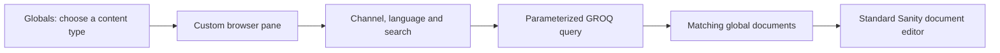

# Customizing Studio: the Globals filters

**Overview**

The Globals browser is a small React component inside Sanity Studio. It gives Case Studies, People, Clients and Services the same channel selector, language selector, search field and document list. Selecting a row opens Sanity's normal document editor.

The customization changes how editors find content. It keeps the existing global documents, references and channel assignments. **Globals** remains the navigation title, and website-specific **Assigned …** shortcuts still lead to those same documents.



For example, choose **Globals → Services → Renaissance → English**. The list shows matching services with their Renaissance names where an edition exists. Each row also shows every channel assigned to that document. **Unassigned** finds documents whose channel array is missing, null or empty; they may still be published or referenced elsewhere.

**1. Find the three main pieces**

| File | Responsibility |
| --- | --- |
| [sanity/structure.ts](/Users/martin/DEV/1SP-dfn-1sp-frontend/sanity/structure.ts) | Adds the custom pane to the navigation and connects rows to document editors. |
| [GlobalsBrowser.tsx](/Users/martin/DEV/1SP-dfn-1sp-frontend/packages/sanity-schema/src/Studio/GlobalsBrowser.tsx) | Renders controls, fetches results, listens for changes and handles pagination. |
| [globalBrowserModel.ts](/Users/martin/DEV/1SP-dfn-1sp-frontend/packages/sanity-schema/src/Studio/globalBrowserModel.ts) | Contains the GROQ query, scope validation, channel labels and creation defaults. |

The component is exported as `@1sp/sanity-schema/studio`. It uses the project's existing React, Sanity UI and icon packages.

**2. Put a React component into the Structure tool**

The `createGlobalBrowser` helper in the structure file builds a navigation item with an `S.component()` child. This shortened example shows the essential connection:

```ts
S.listItem().id('services').title('Services').child(
  S.component()
    .id('services')
    .title('Services')
    .component(GlobalsBrowser)
    .options({schemaType: 'services'})
    .child(documentId =>
      S.document().documentId(documentId).schemaType('services')
    )
)
```

The `schemaType` option lets one component serve all four content types. The actual helper also handles edit intents and preserves old language-pane bookmarks such as `englishEn`.

Inside the component, `usePaneRouter()` supplies `ChildLink`. Each row uses it with the document's base ID, opening the editor in the next pane without replacing Sanity's editing or publishing interface.

**3. Store the filter scope in the pane URL**

Channel and language come from `router.params`. Changing either updates those parameters and resets the result limit:

```ts
function changeScope(key: string, value: string) {
  setLimit(100);
  router.setParams({...router.params, [key]: value});
}
```

This makes channel/language selections bookmarkable. Search text and the number of loaded rows remain local React state; they are not saved in the URL.

`globalBrowserScope()` checks incoming values and defaults to **All channels / English**. Website choices come from `WEBSITE_CHANNELS` and `SITE_CONFIGS`; languages come from `getGlobalLanguageDefinitions()` in the [central site configuration](/Users/martin/DEV/1SP-dfn-1sp-frontend/packages/site-config/src/index.ts).

**4. Filter documents with GROQ**

`useClient()` provides Studio's authenticated Sanity client. The component passes `schemaType`, `channel`, `language`, `search` and `limit` as query parameters. The scope part of the query is:

```groq
_type == $schemaType
&& ($language == "all" || language == $language)
&& (
  $channel == "all"
  || ($channel == "unassigned" && (!defined(channel) || count(channel) == 0))
  || $channel in channel
)
```

The membership check matters because global documents can belong to several channels. Search matches shared names/titles and website-edition names/titles. It strips user-entered wildcards, adds word-prefix wildcards and uses `useDeferredValue` for the search input; this is not a fixed-delay debounce or full-text body search.

The query returns both `total` and `items`. It initially fetches 100 rows; **Load more** increases the limit by 100 and fetches the expanded list again. Rows sort alphabetically using the selected website's name/title when available, with the document ID as a stable tie-breaker.

**5. Resolve drafts before applying assignment filters**

Consider a published person assigned to Renaissance whose draft removes that assignment. In the default Drafts view, the person should move to Unassigned. Showing the published version in Renaissance as well would be misleading.

For that view, the query uses the raw perspective and excludes published documents when a draft with the same base ID exists:

```groq
_id in path("drafts.**")
|| !defined(*[_id == "drafts." + ^._id][0]._id)
```

Here, `^._id` refers to the outer document being checked. The full query also excludes raw release-version documents. `usePerspective()` supplies the selected Studio perspective: when Published or a release is selected, the fetch uses its perspective stack instead. Row badges distinguish drafts, unpublished changes and release versions.

**6. Keep results current and creation predictable**

`client.listen()` watches the current document type. Events trigger another query, grouped with a 200 ms debounce. Effect cleanup removes the listener and prevents obsolete responses from updating the pane. Loading, empty and retry states are rendered explicitly.

**New document** uses an `IntentLink` and templates registered in [sanity.config.ts](/Users/martin/DEV/1SP-dfn-1sp-frontend/sanity.config.ts). The selected language and channel become initial values. All channels or Unassigned starts with an empty channel array. All languages, or a language unsupported by the selected website, hides creation until a valid scope is chosen. Filtering existing documents does not change their assignments.

Services use a neutral `SquaresFour` icon in both the custom browser and their [schema preview](/Users/martin/DEV/1SP-dfn-1sp-frontend/packages/sanity-schema/src/Global/Objects/services.ts). Saved website artwork stays in the service media fields. Other content types retain their thumbnails.

**7. Check or extend the implementation**

Run from the repository root:

```sh
pnpm exec tsx --test scripts/globals-browser.test.ts
pnpm exec tsc --noEmit
```

The five existing tests cover Unassigned, draft precedence, combined filtering/search, pagination counts and creation defaults. In local Studio, also check a channel filter, an empty language result, opening a document and loading more than 100 rows.

To add another global type, add it to `GLOBAL_BROWSER_TYPES`, register its `createGlobalBrowser(...)` navigation item and add its creation template. Check that its fields match the query's assumptions: `channel[]`, `language`, and `name` or `title`. Adapt its title/thumbnail projection if necessary. New website choices come from central site configuration; they do not require another hardcoded dropdown list.

This browser is an editorial convenience, not an access-control boundary. Frontend queries must continue applying their own channel and language filters. The Studio customization itself requires no content migration or publication; it becomes available in the Studio instance running this code.
